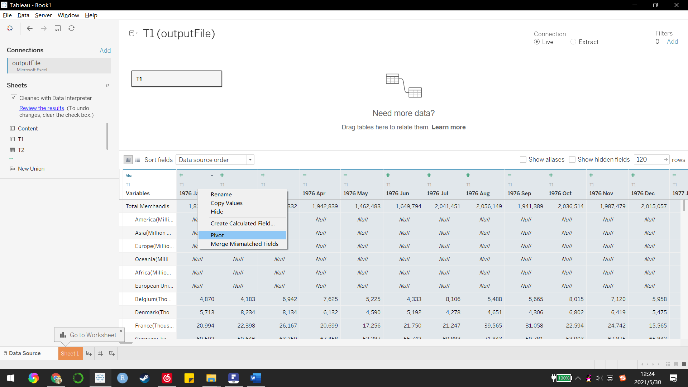

```{r setup, include=FALSE}
knitr::opts_chunk$set(echo = FALSE)
```


# **1 Critique of Visualisation**

The original visualisation can be seen below.


### 1.1 Clarity

1. Area chart makes it difficult to gage height. Two areas overlap and looks messy. Also, area chart doesn&#39;t show the data is a time-series data.
2. Title (2019-2020) and content (2019-2021) are not consistent.
3. Inconsistent Y-axis for different countries makes it hard to compare. For e.g. Some use 0-6M, some use 0-8M, some use 0-2M.
4. Secondary axis makes it hard to compare import and export data.
5. X-axis should use title &#39;Year of period&#39; as it only shows Year.
6. Data source not included.
7. Annotations are not used meaning this is no further elucidation for the graph.

### 1.2 Aesthetic

1. Format of axes: vertical title of Y-axis
2. Horrible color choice for import and export, not distinctive.
3. Ugly font size: Title is smaller than the country name.
4. Gird lines already out the graph.
5. No any picture included.

# 2 Alternative Design

The proposed design is as follows.


### 2.1 Clarity

1. Use line chart to show the time-series data, which shows the trend clearly.

2. Different regions use the same Y axis and they are in the same row, makes it easy and clear to compare. Also imports and exports use the same axis, makes it easy to compare these 2 categories.

3. Have title and sub-title to emphasize the key observations.

4. Have trend line to show the important date and use annotations to show details.

### 2.2 Aesthetic

1. Call-outs with images aid cognition.

2. Tick marks are used for years.

3. Data source and image source is included.

# 3 Proposed Visualisation

 Please view the interactive visualisation on Tableau Public [here](https://public.tableau.com/app/profile/luo.haoyu/viz/Book1_16223766103090/Dashboard1).

# 4 Step-by-step Guide


 1  Import the data into Tableau. 
  
 
 2  Use prep cleaning 
 
 
 3 Use Tableau to pivot the data in sheet. Do the same with T2.  
  
  
 
 4  Change the relationship for T1 and T2 like this. 
  
 
 5  Change the data type and name for T1 and T2 in the worksheet. 
  
 
 6  Use filter to get the country and date we want. 
  
  
 
 7  Drag the columns and rows from data. 
  
 
 8  Choose line graph. 
  
 
 9  Change date(year) to date(month) 
  
 
 10  Add title, sub-title, sources 
  
 
 11  Change Y axis, use the same range for imports and exports, then hide one of the Y axis. 
  
  
  
 
 12  Remove the title for X axis and Y axis. 
  
  
 
 13  Change format to get the tick marks for both axes. 
  
  
 
 14  Add grid lines for row. 
  
 
 15  Hide field labels &#39;country&#39;.
  
 
 16  Change the region names. Remove &#39;Thousand dollars&#39;. 
  
 
 17  Add a reference line. 
  
 
 18  Change the reference line looking and add marks. 
 
 
  
 
 19  Create a dashboard and drag the graph into it. 
  
 
 20  Set the labels floating. 
  
 
 21  Insert an image object and adjust its size. 
  
  
 
 22  Adjust the graph size for better looking and now it looks like this. 
  


# 5 Derived Insights

1. In 2020 Mar, when COVID-19 outbroke, all 6 regions get influenced and their imports and exports amount both declined. After a quarter, merchandise trade for these 6 regions begin to recover.
2. Hong Kong&#39;s exports rise sharply after May 2020, in Mar 2021, it has reached 7.4M thousand dollars.
3. Taiwan&#39;s imports rise sharply after for the whole period, it is only slightly influenced by COVID-19. In Mar 2021 it has reached 5.4M thousand dollars.
4. Hong Kong&#39;s exports is much higher than imports. While Taiwan&#39;s imports is much higher than exports.

