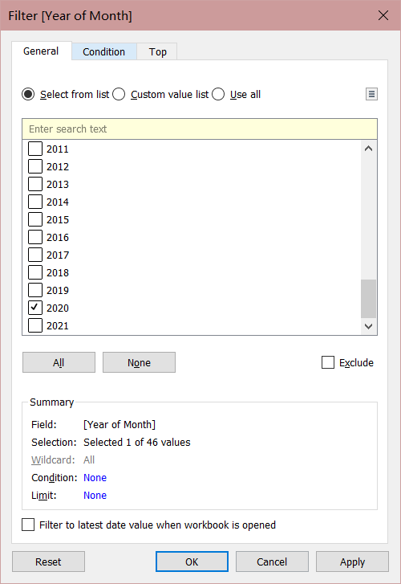
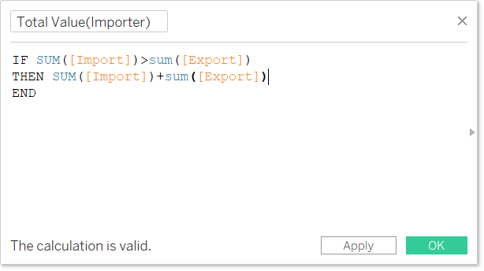
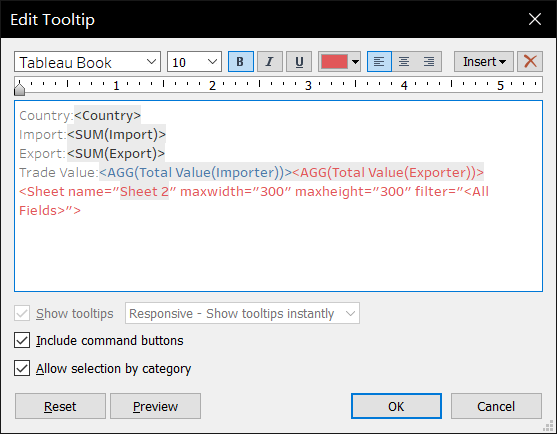

```{r setup, include=FALSE}
knitr::opts_chunk$set(echo = FALSE)
```

# 1 Critique of Visualization

The original visualization can be seen below.


### 1.1 Clarity

1. X and Y axis are messy and wrong:

They are imports and exports value which is numeric data, but they don&#39;t have tick marks or grid lines to indicate clear view of the actual imports and exports amount for different country. The 0 point should be at the beginning of x and y axis but in the graph is not.

1. Title is not concise:

The title is &#39;MERCHANDISE TRADE PERFORMANCE WITH MAJOR TRADING PARTNERS, 2020&#39;, it is very general and do not have sub-title to show further investigations from this graph.

1. The way it presents the net importers and exporters is not clear:

It uses the center point for each country to show whether they belong to importer or exporter. But for countries that have similar import value and export value they lay around the diagonal. So should have a clear way to indicate this.

1. Do not have data source and pictures to show further elucidation.

### 1.2 Aesthetic

1. Presentation of each data point is ugly:

Because the shape of each data point is too big and overlapping. It looks very messy. IT should be smaller and the round should be transparent to get rid of these problems.

1. Horrible color choice for import and export:

Should not use green and blue for two reverse concepts (Net importer and Net exporter).

1. Not interactive:

Do not have further information or other graph when click on each country.

# 2 Alternative Design

The proposed design is as follows.


### 2.1 Clarity

1. Show the data clearly by tooltips:

Use Tooltips to clearly show import and export value and their percentile. Also create a pie chart for each country to show this.

2. Use good title to indicate the investigations:

Use title and sub-title to show the trend of this graph concisely. Also show the data source.

3. Use pie chart to clearly show the percentage import and export takes.

### 2.2 Aesthetic

1. Presentation is more beautiful:

Each data point has smaller shape and is transparent so have a clear view.

2. Use appropriate colors:

Use distinctive color for net importer and net exporter. And show different colors for total trade values while import\&gt;export and import\&lt;export. Makes it very easy to classify the type for each country

1. Data source and image source is included:

By using image can emphasize the information we want to convey in this graph and makes it clear and easy to read this graph.

# 3 Step-by-step Guide


 1  Import the data into Tableau Prep Builder. Click on Cleaned with data interpreter and drag the T1 and T2 into the panel. Rename them with Import and Export.   

 2  Add clean node for Import, custom split Variables column with &#39;(&#39; and rename it with &#39;Country&#39;. Remove the previous column. Do the same with Export.    

 3  Create Pivot1 after clean 1, select all months under &#39;Fields&#39; to the &#39;Pivoted Fields&#39; panel. Repeat for &#39;Pivot 2&#39;.   

 4  Rename &#39;Pivot 1 names&#39; to &#39;Month&#39; and change data type to date. Rename &#39;Pivot 1 values&#39; to &#39;Import&#39;. Repeat for Exports. The name for &#39;pivot 2 values&#39; is Export.   

 5  Do a join for Pivot 1 and 2 by Country=Country and Month=Month.   

 6  Create a new clean node and remove the duplicate month and country.   

 7  Add a new pivot after clean 3 and change imports and exports from columns to rows. Rename &#39;Pivot values&#39; to &#39;Trade Value (Thousand $)&#39; and &#39;Pivot type&#39; to &#39;Trade Type&#39;.   

 8  Create an output node and run the flow. Name the file &#39;Monthly trade values.hyper&#39;.   
 
 9  Open it in Tableau and use sheet 1 to create the first graph. Because the trade value is in thousand dollars we create a new column by multiply 1000 and name it &#39;Trade value&#39;.    

 10  Add month and country to filter to get the 10 countries and year 2020.    

 11  Create a new calculated field called &#39;Import&#39; and create &#39;Export&#39; with same code but type=Export.   
 
 12  Create 2 new calculated field &#39;Total Value (Importer)&#39; and &#39;Total Value (Exporter)&#39;.   

 13  Create a new calculated field called &#39;Reference line&#39;.   

 14  Drag export and import to column and row. And drag country to detail.   

 15  Drag country to color and trade value to size. Change the Opacity to 75%.
    
 
 16  Drag the reference line to rows and change to dual Axis.   

 17  Remove the color, shape of reference line.   

 18  Right click on the reference line data point and click show trend lines. Adjust the size of reference line to 0 and trend line to appropriate looking. Now it only shows the trend line, which is our diagonal line. Hide the reference line axis.    

 19  Create a new sheet, drag trade type to column and trade value to row. Change it to pie chart.   

 20  Drag country to rows. Drag trade type and trade value to labels. Click on the filter to apply filter for all sheets. Change label trade value type to percentage of total and adjust the format to one digit. Drag country to column then will show percentage for each country.     

 21  Back to sheet 1, drag the total value(importer) and total value(exporter) to tooltip. Edit the tooltip this way.    

 22  Add country and total value(importer) and total value(exporter) to label and edit this way.    

 23  Change the format of all value to $\_B   

 24  Add 2 annotations &#39;Net importer&#39; and &#39;Net exporter&#39; at the top left and bottom right.    

 25  Edit the tile and sub title    

 26  Add image and adjust the annotations and axis to get best presentation.    


# 4 Derived Insights

1. Taiwan is the extreme importer in 2020. Its import value takes 66.6% of total which means Taiwan is heavily relying on importing. At the same time, Hong Kong is the extreme exporter with 92.4% of total trade value is export. This shows Hong Kong is a very extreme area that seldom import but largely export goods.
2. China is biggest trading region with $136.2B total trade amount in 2020. And the export and import value is balanced for China. Malaysia has the second biggest trade value of $103.5B in 2020 and United States is the third with $102.4B in 2020.
3. Out of these 9 areas, 6 are net exporter while 3 are net importer. For the 3 net importers (Taiwan, Japan, Malaysia), Taiwan and Japan are island area which may lead to its lack of goods.
